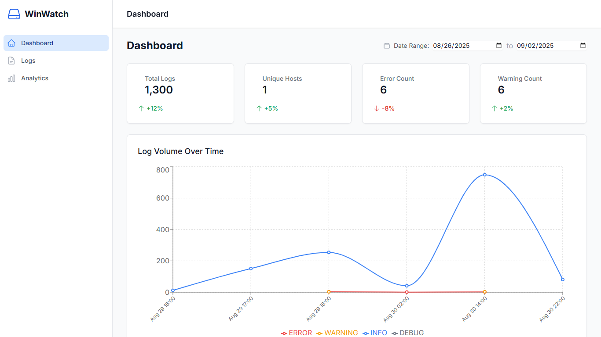

# WinWatch  

<p align="center">
  
</p>

**WinWatch** is a **log analytics pipeline and dashboard** designed to collect, store, query, and visualize **Windows logs**.  

The pipeline integrates:  

- **nxlog (Windows agent)** → Collects logs  
- **Vector (log forwarder on Ubuntu)** → Receives and pushes logs  
- **ClickHouse (DB on Ubuntu)** → Stores logs efficiently  
- **Node.js + Express (backend)** → Exposes APIs to query logs  
- **React + Tailwind CSS (frontend)** → Interactive analytics dashboard  

---

## 🏗️ End-to-End Pipeline  

```mermaid
flowchart LR
    A[Windows Machine] -->|nxlog: TCP logs| B[Vector (Ubuntu)]
    B -->|Ingest & Forward| C[ClickHouse DB]
    C -->|Queries| D[Node.js + Express API]
    D -->|REST API| E[React + Tailwind Dashboard]
````

---

## 📂 Project Structure

```
WinWatch/
├── configs/                 
│   ├── clickhouse/          # ClickHouse configs
│   ├── nxlog/               # Nxlog configs (Windows)
│   ├── vector/              # Vector configs (Ubuntu)
│
├── backend/                 # Node.js + Express backend 
│   ├── config/              # DB connection & env vars
│   ├── models/              # Log models
│   ├── routes/              # API routes
│   ├── services/            # Log query logic
│   └── utils/               # Helpers
│
├── frontend/                # React + Tailwind CSS frontend
│   ├── src/
│   │   ├── components/      # UI building blocks
│   │   ├── pages/           # Dashboard pages
│   │   ├── services/        # API integration
│   │   └── charts/          # Data visualizations
│
└── server.js                # Backend entry point
```

---

## ⚙️ Pipeline Breakdown

### 🔹 1. Nxlog (Windows)

* Collects **Windows Event Logs**
* Forwards logs over **TCP** to the Vector agent

### 🔹 2. Vector (Ubuntu)

* Acts as a **log forwarder**
* Receives JSON-formatted logs from nxlog
* Buffers, transforms, and forwards logs to ClickHouse

### 🔹 3. ClickHouse (Ubuntu)

* **High-performance OLAP database**
* Stores logs in structured format for fast queries
* Schema includes:

  * `timestamp`
  * `hostname`
  * `event_id`

### 🔹 4. Backend (Node.js + Express)

* Connects to ClickHouse
* Provides **REST APIs** for querying logs
* Handles filtering, aggregation, and analytics

### 🔹 5. Frontend (React + Tailwind CSS)

* Calls backend APIs to retrieve log data
* Provides:

  * **Interactive charts**
  * **Tables with filters/search**
  * **Log timelines and trends**

---

## 🚀 Getting Started

### 1. Clone Repo

```bash
git clone https://github.com/YassineFaidi/WinWatch.git
cd WinWatch
```

### 2. Backend Setup

```bash
npm install
node server.js
```

### 3. Frontend Setup

```bash
cd frontend
npm install
npm run dev
```

### 4. Configure Pipeline

* **nxlog:** `configs/nxlog/nxlog.conf`
* **vector:** `configs/vector/vector.yaml`
* **clickhouse:** `configs/clickhouse/`

Update DB connection in:

```bash
backend/config/database.js
```

---

## 📊 Features

* Real-time **Windows log collection**
* Scalable ingestion pipeline with **Vector + ClickHouse**
* Fast log queries via **REST API**
* Interactive dashboards with **charts, filters, search**
* Modular design for easy extension

---

## 🛡️ Security & Roadmap

* [ ] TLS support between nxlog → vector
* [ ] Role-based access for dashboard
* [ ] Alerting system (thresholds & notifications)
* [ ] Advanced filtering & full-text search

---

## 📜 License

MIT License – Free for personal and commercial use.

```

---

✅ Just drop this into your repo as `README.md`.  
Do you want me to also **add a "Quick Demo" section** at the top with a short GIF (if you record dashboard usage) so it’s even more appealing?
```
